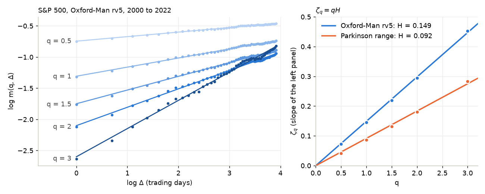

# rough-volatility

How rough is the volatility of the S&P 500, and what does roughness do to option prices?
Each session is one question, answered by an interactive marimo app that opens on a figure
and a slider.



**Headline so far: Ĥ = 0.149 for the S&P 500.** Gatheral, Jaisson and Rosenbaum (2018)
estimator, five moments q from 0.5 to 3, lags 1 to 50 trading days, on 5-minute realised
variance (`rv5`) from the Oxford-Man Institute realised library, 3 January 2000 to
25 February 2022 (5,552 days). The Monte Carlo standard error is about 0.009. Brownian
volatility would give 0.5. The same estimator on a daily high-low range estimator from
Yahoo Finance (2000 to October 2026) gives 0.092, because the range estimator's
measurement noise pulls Ĥ down (see the LOG).

## Sessions

| # | Question | App | Static |
|---|---|---|---|
| 00 | What does H do to a path, and what is H for the S&P 500? | [`sessions/00_what_is_rough.py`](sessions/00_what_is_rough.py) | [`docs/00_what_is_rough.html`](docs/00_what_is_rough.html) |

The full ladder is in [ROADMAP.md](ROADMAP.md); dated findings and open questions are in
[LOG.md](LOG.md).

## Why

Gatheral, Jaisson and Rosenbaum (2018) measured the Hurst exponent of log realised
volatility at about 0.1, far below the 1/2 of every classical stochastic volatility model.
Rough volatility models built on that number (rough Bergomi, rough Heston) fit the steep
short-dated implied volatility skew with few parameters. This repository rebuilds that
chain one runnable step at a time: measure H, simulate a rough model, show its skew.

## How to run

```bash
source ~/phd/.venv/bin/activate          # shared environment; roughvol is installed editable
cd ~/phd/rough-volatility
marimo run sessions/00_what_is_rough.py  # the app, read-only
marimo edit sessions/00_what_is_rough.py # the app with its code
python sessions/00_what_is_rough.py      # run every cell as a script
pytest -m "not slow"                     # tests, about 2 seconds
pytest --impl exercises                  # the same tests against your own exercises/ package
```

Without Python, open the static export in `docs/`.

## Layout

```
roughvol/fbm.py         exact fractional Brownian motion (Davies-Harte, Cholesky fallback)
roughvol/estimate.py    GJR Hurst estimator, multi-q version, second-order variogram, Monte Carlo SE
roughvol/realised.py    S&P 500 daily realised variance: Oxford-Man rv5, Parkinson, Garman-Klass
roughvol/heston_vol.py  Heston variance paths (full truncation Euler), a control with H = 1/2
sessions/               marimo apps, one per session
tests/                  pytest; mathematical tests take an `impl` fixture
data/                   committed caches: spx_rv5_oxford_man.parquet, spx_ohlc_yahoo.parquet
docs/                   static exports and the README figure (docs/make_readme_figure.py)
```

## Data

- **Oxford-Man realised library v0.3** (Heber, Lunde, Shephard and Sheppard 2009). Withdrawn
  in 2022. The last public file was taken from the Internet Archive:
  `https://web.archive.org/web/20220301022212id_/https://realized.oxford-man.ox.ac.uk/images/oxfordmanrealizedvolatilityindices.zip`.
  Only the `.SPX` `rv5` column is kept (100 KB). `roughvol.realised.build_oxford_man_cache`
  rebuilds it.
- **Yahoo Finance `^GSPC`** daily open, high, low and close from 2000, via yfinance.
  `roughvol.realised.build_yahoo_cache` refreshes it.

## References

- Gatheral, Jaisson, Rosenbaum (2018). Volatility is rough. Quantitative Finance 18(6).
- Davies, Harte (1987). Tests for Hurst effect. Biometrika 74(1).
- Fukasawa, Takabatake, Westphal (2019). Is volatility rough? arXiv preprint.

MIT licence.
